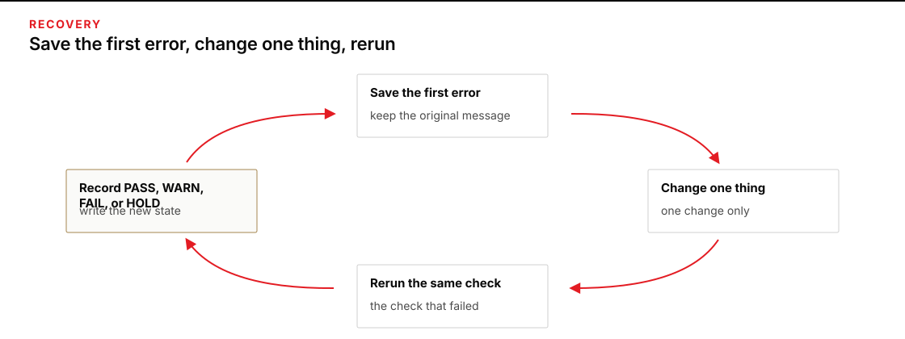
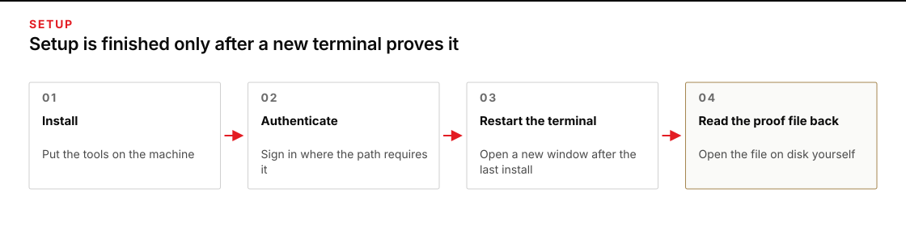

# Module 0 · Set up the harness and direct bounded work

Plan for 1–3 hours of machine setup. Setup is finished only after you reopen the terminal and the tools still work. You will watch the AI tool write a real file using the course launcher, then use the same setup to draft and check a short email against a supplied set of facts.

## Start here

Choose one command-line path and stay in it. A shell is the text window that runs the commands you paste.

| Your machine | Use this guide |
|---|---|
| Windows, no Linux shell | [Windows · PowerShell only](platforms/windows-powershell.md) |
| Windows with or willing to install WSL 2 | [Windows · WSL 2 with Ubuntu](platforms/windows-wsl.md) |
| Mac | [macOS](platforms/macos.md) |
| Ubuntu desktop | [Ubuntu](platforms/ubuntu.md) |
| Arch Linux desktop | [Arch Linux](platforms/arch-linux.md) |

If you are unsure which Windows path to use, choose WSL when your organization permits it and you are comfortable restarting the machine. Choose PowerShell when WSL is blocked or you need a native Windows-only environment. Do not complete both.

## What you will install

- Git and a copy of this course (a repository: a folder Git can version).
- Python 3.12 or newer
- Oh My Pi (`omp`) CLI pinned at version 18.3.5

The AI tool makes a short provider-billed proof call through the course launcher. Before you enter any credential, ask whoever owns your AI provider accounts which account, provider, and model to use.

## Before the first command

- Reserve a restart window.
- Connect to a stable network.
- Keep at least 15 GB free; WSL should have 25 GB.
- Have administrator approval for operating-system packages.
- Keep credentials in the approved password manager or secure handoff.
- **Do not paste a key into a command, Markdown file, shell profile, screenshot, ticket, or repository.**
- If a managed laptop says that policy blocks a step, stop and save the exact message for whoever supports your machine.
- If you use a screen reader, keyboard-only navigation, magnification, voice control, or another access method, read [Accessibility and equivalent operation](shared/ACCESSIBILITY.md) first.

## When a step fails

Save the first error message before you change anything, then work from [When setup stops](shared/TROUBLESHOOTING.md). Change one thing, and run the check that failed again.

*Save the first error, change one thing, and rerun the same check.*

Figure text

Save the first error message. Change one thing. Run the same check again.

## Ready means observable

Setup is finished when a terminal you opened after the last install shows these values:

*Read the proof file from a terminal you opened after the last install.*

Figure text

Install the tools. Open a new terminal. Set the OpenRouter key in that terminal. Run the tool-write proof and read its file from disk. A tool saying done is not the same as a file on disk.

- `origin` reporting `https://github.com/TheHolofex/AI_Harness_Bootcamp.git`, `git rev-parse HEAD` reporting a 40-character id (the setup check prints the first 12); `git status --short` is reported for information only — unrelated changes are preserved and do not block setup or QA;
- Python reporting 3.12 or higher (macOS uses `python3.12 --version`; Ubuntu, Arch, and WSL use `python3 --version`; PowerShell-only uses `python --version`);
- the Oh My Pi version string `omp/18.3.5`, and the absolute path the command resolved to, as printed by the setup check;
- the word `SET` from the key check in that same terminal — and the key value itself printed nowhere;
- one proof file — `from-omp.txt` — read back from disk, written by the tool through the course launcher;
- the same absolute tool path and the same file-writing result you saw in the terminal where you installed everything; and
- a setup report saved outside the Git clone with no key, token, or password in it.

The setup check reports the version, path, repository and key-presence observations as PASS, WARN or FAIL. The separate `verify_tool_proof.py` command checks the tool-written file, its token and the saved execution evidence. A passing setup report does not replace that proof.

Open the proof file and read it back before you accept it: a tool saying “done” is not the same as a file on disk.

## After setup

Put the machine to work: [Give AI a clear, limited job](shared/MODULE_00_LAB.md).
