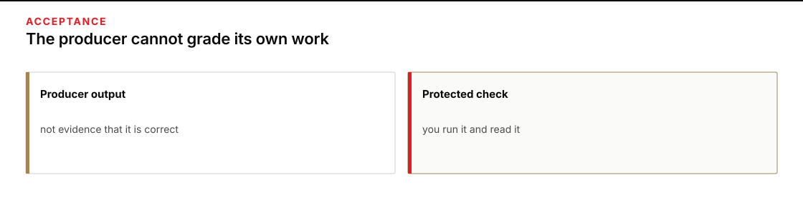
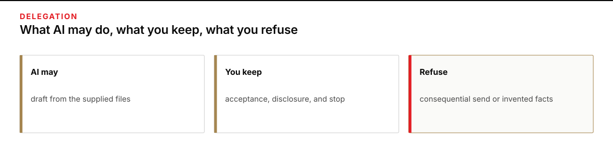

# Module 0 · Give AI a clear, limited job

You will ask one bounded AI tool to draft an internal email, check the actual file against its sources, demonstrate a failing check, and decide whether the result may be used. You will then change one supplied fact without silently changing the rest of the task.

North Shelf is fictional. The email stays with named class participants. It is not a release, vehicle assignment, permit, receipt, dispatch, or public movement order. `HOLD` is a valid outcome when a prerequisite, material fact, or decision owner is unresolved.

Aim for a first checked draft within 60 minutes. That is a planning target, not a measured completion promise or a penalty for using an accessible method. Allow further time for the falsifier, changed input, comparison, and handoff.

## 1. Create the four-file work folder

Finish the appropriate [setup path](../README.md) first. Use an ordinary terminal with the verified interpreter and checkout. These commands work from any directory and create a new external attempt. `W` holds work; sibling `E` holds evidence. Earlier attempts remain untouched.

**Terminal: Bash or zsh, ordinary user.**

```bash
R="$HOME/AI_Harness_Bootcamp"
PY="$(for candidate in python3.12 python3 python; do "$candidate" -c 'import sys; sys.exit(1) if sys.version_info < (3, 12) else print(sys.executable)' 2>/dev/null && break; done)"
M="$R/reformation/AI_Harness_Bootcamp_2/module-00-setup"
RUN="$(date -u +%Y%m%dT%H%M%SZ)-$$"
W="$HOME/course-evidence/module-00-$RUN/work"
E="$HOME/course-evidence/module-00-$RUN/evidence"
"$PY" -c "from pathlib import Path; import shutil,sys; source,w,e=map(Path,sys.argv[1:]); w.mkdir(parents=True,exist_ok=False); e.mkdir(parents=True,exist_ok=False); names=('SOURCE_PACKET.md','REQUEST.md','CHANGED_INPUT.md','check_artifact.py'); [shutil.copyfile(source/name,w/name) for name in names]; print('\n'.join(sorted(p.name for p in w.iterdir())))" "$M/shared/case" "$W" "$E"
```

**Terminal: PowerShell, ordinary user.**

```powershell
$R = "$HOME\AI_Harness_Bootcamp"
$PY = $(foreach ($candidate in 'python3.12','python3','python') { try { $resolved = & $candidate -c 'import sys; sys.exit(1) if sys.version_info < (3,12) else print(sys.executable)' 2>$null; if ($LASTEXITCODE -eq 0 -and $resolved) { $resolved.Trim(); break } } catch {} })
if (-not $PY) { throw 'HOLD: Python 3.12 or newer is required.' }
$M = "$R\reformation\AI_Harness_Bootcamp_2\module-00-setup"
$RUN = [guid]::NewGuid().ToString('N')
$W = "$HOME\course-evidence\module-00-$RUN\work"
$E = "$HOME\course-evidence\module-00-$RUN\evidence"
& $PY -c "from pathlib import Path; import shutil,sys; source,w,e=map(Path,sys.argv[1:]); w.mkdir(parents=True,exist_ok=False); e.mkdir(parents=True,exist_ok=False); names=('SOURCE_PACKET.md','REQUEST.md','CHANGED_INPUT.md','check_artifact.py'); [shutil.copyfile(source/name,w/name) for name in names]; print('\n'.join(sorted(p.name for p in w.iterdir())))" "$M\shared\case" "$W" "$E"
```

**Expected:** The work folder contains exactly `SOURCE_PACKET.md`, `REQUEST.md`, `CHANGED_INPUT.md`, and `check_artifact.py`.

**Stop:** A destination exists, copying fails, or a source is missing.

**Recovery:** Preserve the partial attempt. Repair the path or prerequisite, then repeat the block with a new `RUN`. Do not delete earlier work or change the source checkout.

## 2. Identify who decides acceptance

Open `W/check_artifact.py` and the [public rubric](../assessment/PUBLIC_RUBRIC.md). The local checker is inspectable practice software. Its output cannot independently certify the meaning of your email, your judgment, or human qualification. Editing a practice checker does not make a draft more defensible.

Create `W/acceptance-control.md` in your editor. Name the practice checker, the decision owner, the published standard, and two qualities the checker cannot establish. If an assessment is being used, identify the actual independent evaluator and decisive task/result custody. If those are unavailable, record qualification as `HOLD`; do not assume that files in a public checkout are secret controls.



**Figure text:** The producer supplies a draft. You inspect its evidence; an independent evaluator is needed for any separate qualification claim.

**Expected:** Your record distinguishes a mechanical practice result from a supported use decision and from qualification.

**Stop:** You cannot identify who owns the decision or what evidence they require.

**Recovery:** Resolve that responsibility before drafting. Do not let the producing model declare itself qualified.

## 3. Read the packet and checker in full

Open `W/SOURCE_PACKET.md`, `W/REQUEST.md`, and `W/check_artifact.py` in your editor. Leave `CHANGED_INPUT.md` unopened until stage 13.

The packet distinguishes a request, custody, paperwork availability, and release authority. The request requires a 130–190-word email with a subject and contact line. The checker recognizes selected facts and prohibited claims, but it can miss meanings expressed in unfamiliar wording.

In `acceptance-control.md`, add one example of a claim that still needs your reading even if the checker passes. Do not infer pickup readiness, a vehicle, a permit, or a confirmed receipt from a count or a paperwork window.

**Expected:** You can point to the source of each material requirement and explain at least one mechanical-check limitation.

**Stop:** A required fact is absent or you are treating a true fact as authority for a different action.

**Recovery:** Keep the claim unresolved. Do not fill a gap with a model guess.

## 4. Divide drafting, judgment, and prohibited action

Create `W/direction-brief.md`. State what AI may draft, what judgment remains yours, and what it must not do. The AI may reorganize supplied facts into the requested email. You retain source interpretation, acceptance, disclosure, and the sharing decision. A real send, release, or invented service is outside scope.



**Figure text:** Delegate the bounded draft. Keep acceptance and consequential decisions with the named human owner. Refuse invented authority and external action.

**Expected:** The three responsibilities are explicit and fit this request.

**Stop:** Your delegation would let the model authorize a movement or decide a real operational policy.

**Recovery:** Narrow the task before any call. If it cannot be narrowed without changing the mission, hold it.

## 5. Complete the minimum responsibility screen

Create `W/minimum-screen.md` and answer each line from what you inspected:

```text
Source and data authority:
Sensitive data present:
Affected audience or person:
Disclosure needed:
Consequential action this draft cannot authorize:
Human decision owner:
Unresolved item:
Decision to proceed with a class draft, or HOLD:
```

**Expected:** You have permission to use the fictional sources, know the audience, and can name the person who owns the bounded decision.

**Stop:** Source/data authority or decision ownership is unresolved.

**Recovery:** Resolve the missing authority with its actual owner. Do not draft while assuming someone else will accept the responsibility later.

## 6. Freeze a testable direction

Complete `direction-brief.md` with the outcome, audience, allowed sources, material constraints, acceptance condition, prohibited result, stop condition, and decision owner. Include a specific **falsifier**: an observation that would disprove a material claim or defeat acceptance. “The email might be wrong” is not specific enough.

Set a limit of two deliberate correction attempts before `HOLD`. A correction requires a diagnosed cause and a fresh retained attempt; this is not permission for automatic retries until a favorable answer appears.

In your editor, save the following instruction as `W/prompt.txt`. Keep your own direction brief beside it.

```text
Read direction-brief.md, minimum-screen.md, REQUEST.md, and SOURCE_PACKET.md.
Use only SOURCE_PACKET.md as factual authority for this first draft. Do not read
CHANGED_INPUT.md yet. Draft the requested internal email within the brief's bounds
and write it to artifact.md using course_write. Do not change another file or take
an external action. After writing, report the path only.
```

**Expected:** Your direction and prompt exist before the first call, with testable constraints and a concrete failure observation.

**Stop:** The direction leaves a consequential choice to the model or conflicts with the supplied request.

**Recovery:** Correct the brief before running. Preserve any earlier version and its reason for change.

## 7. Produce one actual tool-written draft

Use the shared launcher, not a personal agent profile. It exposes only the declared course tools and permits only the new `artifact.md` output. The child receipt directory must not exist already.

**Terminal: Bash or zsh, ordinary user.**

```bash
"$PY" "$R/reformation/shared/run_omp.py" --workdir "$W" --prompt "$W/prompt.txt" --evidence "$E/first-draft" --allow-write artifact.md
```

**Terminal: PowerShell, ordinary user.**

```powershell
& $PY "$R\reformation\shared\run_omp.py" --workdir "$W" --prompt "$W\prompt.txt" --evidence "$E\first-draft" --allow-write artifact.md
```

**Expected:** A complete turn produces the actual file and matching policy, tool, guard, and filesystem receipts. Launcher exit 0 establishes completion within that boundary, not correctness of the email.

**Stop:** Exit 2 means a prerequisite failed before a valid turn; exit 1 means attempted work was incomplete or violated a required check. Missing key, no actual file, mismatched identity, or a forbidden effect keeps this stage on `HOLD`.

**Recovery:** Preserve the first failure and any partial file. Restore the prerequisite or diagnose the instruction problem before beginning a fresh retained attempt. Do not manufacture `artifact.md`, overwrite it, or rerun into the same receipt child.

## 8. Read the disk file, count words, and check

Open `W/artifact.md` in your editor and read it, rather than relying on the assistant's path claim. The checker uses its own documented word-count rule; ordinary editor counts may differ slightly around punctuation.

**Terminal: Bash or zsh, ordinary user.**

```bash
"$PY" "$W/check_artifact.py" "$W/artifact.md"
```

**Terminal: PowerShell, ordinary user.**

```powershell
& $PY "$W\check_artifact.py" "$W\artifact.md"
```

**Expected:** The output reports the actual word count and each mechanical observation. A suitable original draft has 130–190 words and passes those checks.

**Stop:** The file is missing, a mechanical condition fails, or your reading finds a contradiction that the checker missed.

**Recovery:** Retain the draft and failed result. Explain the cause before using one of your two fresh correction attempts. Do not edit the checker to accept a bad draft.

## 9. Trace material claims yourself

Create `W/source-check.md`. Quote each material statement about quantity, custody, paperwork timing, authority, and prohibited clinic action, then give its exact supporting packet line or paragraph. Mark unsupported implications as well as plainly wrong facts.

**Expected:** The email's material claims are supported, and the distinctions between custody/release and paperwork/pickup remain explicit.

**Stop:** A statement is true but is being used to justify a different action, or no exact support exists.

**Recovery:** Hold the draft and name the missing or overextended authority. A green mechanical check does not settle this judgment.

## 10. Make a failing copy without changing the original

Test whether the visible check can reject a known wrong count. The following block changes the original on-hand number only in a separate falsifier file. It also records the original draft's hash for the later unchanged-file check.

**Terminal: Bash or zsh, ordinary user.**

```bash
"$PY" -c "from pathlib import Path; import hashlib,re,sys; w,e=map(Path,sys.argv[1:]); raw=(w/'artifact.md').read_bytes(); bad,n=re.subn(r'\b27\b','28',raw.decode('utf-8')); n or sys.exit('HOLD: original count was not found'); f=(w/'falsifier-probe.md').open('x',encoding='utf-8'); f.write(bad); f.close(); h=(e/'original-artifact.sha256').open('x'); h.write(hashlib.sha256(raw).hexdigest()+'\n'); h.close()" "$W" "$E" &&
"$PY" "$W/check_artifact.py" "$W/falsifier-probe.md"
```

**Terminal: PowerShell, ordinary user.**

```powershell
& $PY -c "from pathlib import Path; import hashlib,re,sys; w,e=map(Path,sys.argv[1:]); raw=(w/'artifact.md').read_bytes(); bad,n=re.subn(r'\b27\b','28',raw.decode('utf-8')); n or sys.exit('HOLD: original count was not found'); f=(w/'falsifier-probe.md').open('x',encoding='utf-8'); f.write(bad); f.close(); h=(e/'original-artifact.sha256').open('x'); h.write(hashlib.sha256(raw).hexdigest()+'\n'); h.close()" "$W" "$E"
if ($LASTEXITCODE -ne 0) { throw 'Falsifier preparation stopped.' }
& $PY "$W\check_artifact.py" "$W\falsifier-probe.md"
```

**Expected:** Exit 1 and the failed on-hand check are the desired negative observation. `artifact.md` is unchanged. Save the exact failed condition in `W/falsifier-observation.md` and compare it with the falsifier you predicted.

**Stop:** The wrong copy passes, preparation overwrites an existing file, or you cannot connect the failure to the deliberate change.

**Recovery:** Keep the unexpected result and explain the check's limit. Do not keep inventing a different error until a passing demonstration appears.

## 11. Describe an observed capability and limit

Create `W/capability-limit.md`. Distinguish the model's text, the terminal/file interface, the harness's enforced permissions and recorded checks, and the human decision. Name one capability and one limitation supported by this attempt's evidence.

**Expected:** Your claims refer to actual behavior rather than a general claim that AI is reliable or unreliable.

**Stop:** The claimed capability was never exercised, or a chat statement is being used as proof of an action.

**Recovery:** Narrow the claim to the observation you have. Mark an unavailable live turn as blocked, not simulated success.

## 12. Make the bounded human decision

In `W/decision.md`, choose `PASS FOR CLASS REVIEW` or `HOLD`, name the owner, and explain the supporting evidence and remaining limit. This is not permission to send the email to a real operations list.

**Expected:** The decision respects the source trace, responsibility screen, observed falsifier, and class-only audience.

**Stop:** Any material concern remains unresolved or the audience extends beyond the supplied authority.

**Recovery:** Keep the draft on hold and name who must resolve the issue. Mechanical success and model authorship do not certify a human operator.

## 13. Apply the changed input, compare, and hand off

Now open `W/CHANGED_INPUT.md`. Before running again, create `W/changed-input-prediction.md`: record what must change, what must stay unchanged, and why. The changed input replaces the on-hand count; it does not grant new authority.

Save this as `W/prompt-changed.txt` in your editor:

```text
Read direction-brief.md, REQUEST.md, SOURCE_PACKET.md, and CHANGED_INPUT.md.
Apply only the supplied changed input. Preserve all other supported facts,
unknowns, and authority/sharing limits. Write the revised 130–190-word email to
artifact-changed.md using course_write. Leave artifact.md and every other file
unchanged. After writing, report the new path only.
```

**Terminal: Bash or zsh, ordinary user.**

```bash
"$PY" "$R/reformation/shared/run_omp.py" --workdir "$W" --prompt "$W/prompt-changed.txt" --evidence "$E/changed-draft" --allow-write artifact-changed.md
```

**Terminal: PowerShell, ordinary user.**

```powershell
& $PY "$R\reformation\shared\run_omp.py" --workdir "$W" --prompt "$W\prompt-changed.txt" --evidence "$E\changed-draft" --allow-write artifact-changed.md
```

**Expected:** A complete new turn writes a separate revised email using the new count. The original file remains intact.

**Stop:** The launcher holds, the original changes, or the revised email changes authority or a fact not named by the changed input.

**Recovery:** Preserve both versions and the failed turn. Diagnose the unsupported change; do not silently replace the original or broaden the task.

Run the original checker on the changed draft, then compare the two files. The checker still expects the original count; its stale-count failure is intentional.

**Terminal: Bash or zsh, ordinary user.**

```bash
"$PY" "$W/check_artifact.py" "$W/artifact-changed.md"
```

**Terminal: PowerShell, ordinary user.**

```powershell
& $PY "$W\check_artifact.py" "$W\artifact-changed.md"
```

**Expected:** The old on-hand-27 condition fails on a correct 19-count revision. Other mechanical conditions should remain satisfied. This is a changed-input observation, not permission to ignore unrelated failures.

**Stop:** The old count still appears as current, an unrelated condition fails, or the original checker was edited to hide the stale requirement.

**Recovery:** Preserve the failure and trace it to the changed or unchanged source fact. Keep the original checker unchanged.

**Terminal: Bash or zsh, ordinary user.**

```bash
"$PY" -c "from pathlib import Path; import difflib,hashlib,sys; w,e=map(Path,sys.argv[1:]); original=(w/'artifact.md').read_bytes(); same=hashlib.sha256(original).hexdigest()==(e/'original-artifact.sha256').read_text().strip(); print('ORIGINAL UNCHANGED' if same else 'HOLD: original changed'); print(''.join(difflib.unified_diff(original.decode('utf-8').splitlines(True),(w/'artifact-changed.md').read_text().splitlines(True),fromfile='original',tofile='changed'))); sys.exit(not same)" "$W" "$E"
```

**Terminal: PowerShell, ordinary user.**

```powershell
& $PY -c "from pathlib import Path; import difflib,hashlib,sys; w,e=map(Path,sys.argv[1:]); original=(w/'artifact.md').read_bytes(); same=hashlib.sha256(original).hexdigest()==(e/'original-artifact.sha256').read_text().strip(); print('ORIGINAL UNCHANGED' if same else 'HOLD: original changed'); print(''.join(difflib.unified_diff(original.decode('utf-8').splitlines(True),(w/'artifact-changed.md').read_text().splitlines(True),fromfile='original',tofile='changed'))); sys.exit(not same)" "$W" "$E"
```

**Expected:** The original hash matches. Read every material change in the diff and compare it with your prediction; changed wording is not automatically a changed fact.

**Stop:** A material difference is unsupported or an expected nonchange did not survive.

**Recovery:** Record the mismatch in `W/changed-input-comparison.md` and hold the revised draft. Do not treat a diff as a substitute for reading its meaning.

Write `W/handoff.md` with the purpose, source boundary, draft locations, actual checks, decision, observed limit, unresolved owner, and first file the next reader should inspect. Keep work and receipts outside the checkout.

<details markdown="1">
<summary>Optional stretch: remove an unsupported readiness implication</summary>

## Repair an implication, not merely a number

Consider this draft sentence. It is an example to examine, not an additional source fact:

> The 19 kits are counted and staged in pen 4 for Field Clinic S-3, and the Thursday and Friday window is available for paperwork.

Explain how a hurried reader could promote custody or paperwork availability into pickup readiness. Do not assume your own correct draft already contains that flaw.

In your editor, create a separate `W/artifact-stretch.md` from the changed draft. Repair the implication within the same 130–190-word email. State custody-not-release and paperwork-not-pickup explicitly, using only the original packet and changed input. Keep both original artifacts unchanged.

In `W/stretch-trace.md`, quote every material change and its source support, then list the material facts and authority limits that did not change. Count the new draft with the unchanged practice checker, remembering that its 27-count condition is stale for this input.

**Terminal: Bash or zsh, ordinary user.**

```bash
"$PY" "$W/check_artifact.py" "$W/artifact-stretch.md"
```

**Terminal: PowerShell, ordinary user.**

```powershell
& $PY "$W\check_artifact.py" "$W\artifact-stretch.md"
```

**Expected:** The word-count and unchanged mechanical conditions remain satisfied; the original count condition still fails as expected. Your source trace, not the checker alone, establishes whether the unsupported implication was removed.

**Stop:** The repair creates new authority, changes another fact, exceeds the word bound, or silently alters either retained artifact.

**Recovery:** Preserve the stretch attempt and name the unsupported change. Revise only after identifying its source or deciding it must be removed. A mechanical result cannot certify the reader's interpretation or human qualification.

</details>

After a machine change, open a new terminal and run the setup check in it. Keep the request, sharing limit, source comparison, and exact first error with the attempt.

Continue with [Module 1 · Verify sources and outputs](../../module-01-mission-thread/README.md).
