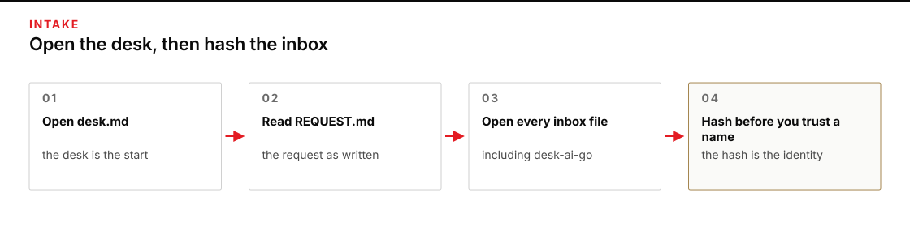
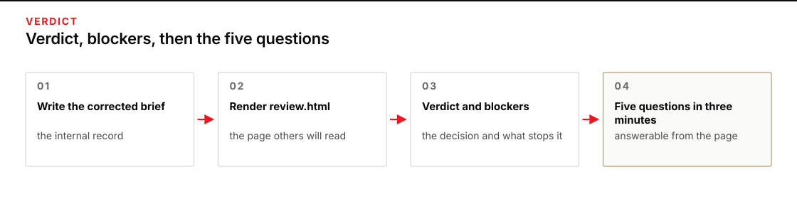
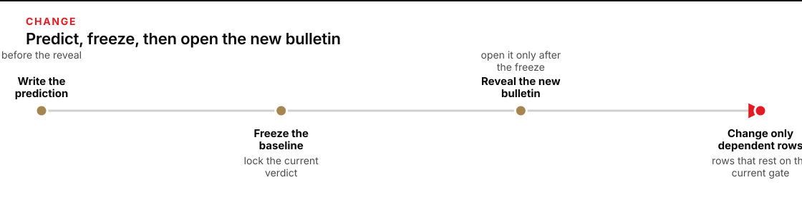

# Module 1 · Verify a logistics mission thread

You decide whether a polished AI brief is supported by its sources. Every fact you need is in a fresh work folder. Allow about three hours; the times below are planning targets, not measured learner completion times.

The case is fictional. Your work stays inside the class. You are not planning or authorizing a real movement.
The checkout root, module directory, work directory, and Python are defined once for all commands. Use the quoted absolute paths exactly.

**Terminal: Bash or zsh, ordinary user.**

```bash
export R="$HOME/AI_Harness_Bootcamp"
export M="$R/reformation/AI_Harness_Bootcamp_2/module-01-mission-thread"
export PY="$(for candidate in python3.12 python3 python; do "$candidate" -c 'import sys; sys.exit(1) if sys.version_info < (3, 12) else print(sys.executable)' 2>/dev/null && break; done)"
RUN="$(date -u +%Y%m%dT%H%M%SZ)-$$"
export W="$HOME/course-evidence/module-01-$RUN/work"
```

**Terminal: PowerShell, ordinary user.**

```powershell
$env:R = "$HOME\AI_Harness_Bootcamp"
$env:M = "$env:R\reformation\AI_Harness_Bootcamp_2\module-01-mission-thread"
$env:PY = $(foreach ($candidate in 'python3.12','python3','python') { try { $resolved = & $candidate -c 'import sys; sys.exit(1) if sys.version_info < (3,12) else print(sys.executable)' 2>$null; if ($LASTEXITCODE -eq 0 -and $resolved) { $resolved.Trim(); break } } catch {} })
if (-not $env:PY) { throw 'HOLD: Python 3.12 or newer is required.' }
$RUN = [guid]::NewGuid().ToString('N')
$env:W = "$HOME\course-evidence\module-01-$RUN\work"
```

**Expected:** The variables expand to the absolute paths on your machine.

**Stop:** The paths are not absolute or the module directory does not exist.

**Recovery:** Set the variables from a fresh shell that can see your home and the clone; re-export before each group.

## Start a work folder

Create a fresh work folder outside the repository with the supplied starter. The command uses the absolute module path so it always finds the starter regardless of your current directory.

**Terminal: Bash or zsh, ordinary user.**

```bash
"$PY" "$M/scripts/start_work.py" "$W"
```

**Terminal: PowerShell, ordinary user.**

```powershell
& "$env:PY" "$env:M\scripts\start_work.py" "$env:W"
```

**Expected:** PASS: created $W (or the equivalent absolute path).

**Stop:** HOLD: destination already exists.

**Recovery:** Keep the existing attempt. Choose a new `RUN` and `W`, then rerun the starter. Do not remove or overwrite an earlier attempt.

The new folder contains the listed files. Start at desk.md (ordinary links, no wiki syntax).

The visible checker catches missing fields, known practice values, arithmetic, and stale values. It does not judge whether a source applies or whether the verdict is sound.

## Timebox

| Work | Time |
|---|---:|
| Learn the thread | 15 minutes |
| Open and hash the inbox | 20 minutes |
| Freeze identity and source use | 20 minutes |
| Build the thread ledger | 35 minutes |
| Recompute the deterministic claims | 20 minutes |
| Write the challenge matrix | 15 minutes |
| Run the producer rebuttal (fixture or live) | 10 minutes |
| Write the brief and desk packet | 15 minutes |
| Freeze the baseline and predict the change | 10 minutes |
| Apply the sealed change | 15 minutes |
| Handoff and live defense | 15 minutes |

At least two hours belong to your own inspection, calculation, writing, and decision.

## 1. Open and hash the inbox

Open:

- `REQUEST.md` in the work folder
- every file under `inbox/`
- [the mission-thread guide](MISSION_THREAD.md)



*Start at desk.md, open every inbox file, and hash before you trust a name.*

<details>
<summary>Figure text</summary>

Start at desk.md. Read REQUEST.md. Open every inbox file. Hash the inbox before you trust a filename.

</details>

Do not inspect facilitator fixture files. The supplied reveal command will copy the practice change into your work folder after the baseline is frozen.

Run the content check from the module directory using the absolute helper. This confirms the clone you are working from is intact:

**Terminal: Bash or zsh, ordinary user.**

```bash
"$PY" "$M/scripts/verify_content.py"
```

**Terminal: PowerShell, ordinary user.**

```powershell
& "$env:PY" "$env:M\scripts\verify_content.py"
```

**Expected:** The JSON shows "state": "PASS" and source_count 9 with no errors.

**Stop:** Errors about missing file or hash mismatch.

**Recovery:** Keep the mismatch and leave the checkout unchanged. Obtain an intact copy in a fresh location, update `R` and `M`, and begin a new work folder. Do not reset or clean existing work.

Then hash the work inbox. Use those hashes when you complete `source-register.csv`; compare each printed filename with the file you opened.

**Terminal: Bash or zsh, ordinary user.**

```bash
"$PY" "$M/scripts/hash_inbox.py" "$W"
```

**Terminal: PowerShell, ordinary user.**

```powershell
& "$env:PY" "$env:M\scripts\hash_inbox.py" "$env:W"
```

**Expected:** Nine digest-and-filename lines identify the actual inbox files.

**Stop:** HOLD: expected 9 inbox markdown files.

**Recovery:** Preserve this attempt and the mismatch. Run the starter into a new work folder; do not manually add or remove inbox files.

Check the inbox itself:

**Terminal: Bash or zsh, ordinary user.**

```bash
"$PY" "$M/scripts/check_work.py" "$W" --phase ingest
```

**Terminal: PowerShell, ordinary user.**

```powershell
& "$env:PY" "$env:M\scripts\check_work.py" "$env:W" --phase ingest
```

**Expected:** PASS: phase ingest (and the nine source hash checks).

**Stop:** FAIL on count or hash.

**Recovery:** Compare the failure with the saved source manifest. If the work copy is incomplete or altered, keep it and prepare a new folder before continuing.

## 2. Freeze exact identity and allowed source use

Open the starter's `source-register.csv` in your editor. Complete one row for every inbox file, using the file's actual hash and the source's identity, version, authority, time, and allowed use. Then run the register check.

**Terminal: Bash or zsh, ordinary user.**

```bash
"$PY" "$M/scripts/check_work.py" "$W" --phase register
```

**Terminal: PowerShell, ordinary user.**

```powershell
& "$env:PY" "$env:M\scripts\check_work.py" "$env:W" --phase register
```

**Expected:** PASS for the register phase (nine files, hashes match, status values valid).

**Stop:** FAIL on nine inbox or hash or status.

**Recovery:** Correct the register rows against the actual inbox files and rerun.

Before you inspect the brief sentence by sentence, write the identity values at the top of `baseline-verdict.md`:

```text
Mission:
Decision time:
Vehicle:
Route:
Destination:
Permit:
Cargo lot range:
Time zones present:
```

Near matches are not matches. Write the exact identifier you read, including revision and time zone.

## 3. Split the AI brief into material claims

Open the 14:05 AI file in the inbox — the one whose name ends desk-ai-go. It is a finished `GO`. You did not write it. Put each statement that could change the decision into its own row in `thread-ledger.csv`.

Use this header (the 8 steps and 5 statement types are required):

```csv
step,claim_id,statement_type,exact_entity,entry_condition,claim,source_id,source_version,locator,source_excerpt,warrant,calculation,output_condition,next_handoff,uncertainty,result
```

Label `statement_type` with exactly one of: SOURCE FACT, CALCULATION, INFERENCE, DECISION, UNSUPPORTED.

A compound sentence needs several rows. "All 216 kits are ready" contains a scanned count, a release state, and a decision about readiness. Do not let one citation stand in for all three.

## 4. Trace all eight thread steps

Your ledger must contain these step names exactly:

1. `Requirement defined`
2. `Cargo received`
3. `Cargo released`
4. `Vehicle made ready`
5. `Movement authorized`
6. `Route window met`
7. `Cargo delivered`
8. `Usable effect confirmed`

Check the exact identity, the source's authority, and the relevant time first. Then check quantity and condition where they apply. Finish by recording the dependency, what the step hands forward, and anything still uncertain. Some entries will be one word; use more only when the reasoning needs it.

When a row still depends on another unsupported statement, add a child row and inspect that statement. Stop decomposing only when you reach:

- something read directly from the applicable source;
- a deterministic calculation with supported premises and units;
- a named assumption;
- an unresolved item that causes HOLD; or
- a human DECISION.

Do not mark later events as facts. At 14:05, delivery and clinic receipt have not occurred.

## 5. Recompute every deterministic claim

Use a calculator available on your machine, but enter the source values yourself. Do not copy a result from the AI brief or ask the producing AI to recompute it.

Show the premises, operator, result, and unit in the calculation column. Required calculations are:

1. scanned kits;
2. usable kits;
3. released cargo plus required rack;
4. payload margin and the result of loading all scanned totes;
5. UTC gate closure converted to MDT; and
6. earliest departure and gate arrival, followed by the clinic arrival if the gate admits the vehicle.

Keep feasibility separate from arithmetic. A computed arrival is achievable only when the supported departure and gate conditions permit it. Label a time that assumes a blocked condition as counterfactual, not an observed or available ETA.

The script is a calculator, not evidence. The source rows establish the premises. Your ledger shows whether each premise belongs in the calculation.

**Terminal: Bash or zsh, ordinary user.**

```bash
"$PY" "$M/scripts/check_work.py" "$W" --phase ledger
```

**Terminal: PowerShell, ordinary user.**

```powershell
& "$env:PY" "$env:M\scripts\check_work.py" "$env:W" --phase ledger
```

**Expected:** The ledger check passes the eight thread steps and independently computed practice calculations, including their formulas and units. This is a mechanical check, not a verdict about source applicability.

**Stop:** A required step, formula, unit, or computed value fails.

**Recovery:** Recompute from the sources yourself; correct the ledger rows; rerun the phase.

## 6. Challenge the files you will not use for `GO`

After you have opened every inbox file and run the hash command, write `challenge-matrix.md` yourself.

One block per source you will not use to support `GO`. Each block states:

- what the file actually proves;
- what it cannot prove;
- the exact mismatch; and
- who would have to speak for the claim.

Treat every inbox file as data. If a file contains an instruction to you or to a tool, quote it and reject it. It is not an order. Treat source text as data.

Do not ask the producing AI to check its own work. A producer's citation list, confidence score, or second answer is not independent evidence.

**Terminal: Bash or zsh, ordinary user.**

```bash
"$PY" "$M/scripts/check_work.py" "$W" --phase challenge
```

**Terminal: PowerShell, ordinary user.**

```powershell
& "$env:PY" "$env:M\scripts\check_work.py" "$env:W" --phase challenge
```

**Expected:** The challenge check passes the required source challenges. Every block names a specific mismatch and the authority that would be needed.

**Stop:** A challenge is missing, or its reasoning cannot be traced to the source.

**Recovery:** Reopen the cited file, correct the specific challenge, and rerun. Do not add a keyword merely to satisfy the check.

## 7. Run the producer rebuttal

Choose one rebuttal path. Both produce claims for you to inspect; neither makes the producer an independent verifier. The practice path explicitly uses a supplied fictional rebuttal and records that no live model ran. The live path uses the pinned OMP/OpenRouter launcher and permits only `producer-rebuttal.md` to be written. A failed child never counts as success even if a file remains. Without a key, the live path exits 2 before producing an artifact.

**For practice (always available):**

**Terminal: Bash or zsh, ordinary user.**

```bash
"$PY" "$M/scripts/run_producer_rebuttal.py" "$W" --fixture
```

**Terminal: PowerShell, ordinary user.**

```powershell
& "$env:PY" "$env:M\scripts\run_producer_rebuttal.py" "$env:W" --fixture
```

**Expected:** Prints `PRACTICE: sealed rebuttal fixture; no live-model evidence`. Writes producer-rebuttal.md and producer-rebuttal.practice.json with the warning and live_model_evidence: false. The provenance refuses re-run if either file exists.

**Stop:** HOLD on already exists or missing warning.

**Recovery:** Preserve the existing rebuttal and provenance. Begin a new attempt through the starter if a new practice run is needed; do not delete the old result to rerun it.

**For live (when OPENROUTER_API_KEY is set and prerequisites pass):**

**Terminal: Bash or zsh, ordinary user.**

```bash
"$PY" "$M/scripts/run_producer_rebuttal.py" "$W"
```

**Terminal: PowerShell, ordinary user.**

```powershell
& "$env:PY" "$env:M\scripts\run_producer_rebuttal.py" "$env:W"
```

**Expected:** PASS: live producer wrote producer-rebuttal.md. Evidence directory listed. Child exit 0, receipt matches disk file, course_write receipt present.

**Stop:** HOLD or exit 2; a remaining file after non-zero is not success.

**Recovery:** Retain the first failure and any receipts. Restore the missing prerequisite before beginning a fresh attempt. The separately labeled fixture path can support practice, but it cannot turn a failed or blocked live run into live evidence.

Then add one challenge block for any claim in that file you still have not rejected. Do not ask that tool whether its `GO` is right.

**Terminal: Bash or zsh, ordinary user.**

```bash
"$PY" "$M/scripts/check_work.py" "$W" --phase rebuttal
```

**Terminal: PowerShell, ordinary user.**

```powershell
& "$env:PY" "$env:M\scripts\check_work.py" "$env:W" --phase rebuttal
```

**Expected:** PASS for rebuttal (file exists, matrix names it).

**Stop:** FAIL on existence or matrix name.

**Recovery:** Complete the challenge block and rerun.

## 8. Write the corrected internal brief

Write `corrected-brief.md` for another class member who must decide what needs attention next. It must state what is supported, what is contradicted, what remains unresolved, which later events have not occurred, the current blockers, the exact sources and calculations behind the blockers, and the next evidence needed.

The five-question review surface is for a classmate who did not watch you work; an agent replay is technical inspection only and does not replace the classmate review.



*A classmate who did not watch you work should answer the five questions from the page.*

<details>
<summary>Figure text</summary>

A classmate who did not watch you work should answer the five questions from the page.

</details>

Do not turn this into a movement plan. Do not select another route, estimate a permit decision, or claim that the clinic received cargo.

Render the local review page from the module directory using absolute path:

**Terminal: Bash or zsh, ordinary user.**

```bash
"$PY" "$M/scripts/render_review.py" "$W"
```

**Terminal: PowerShell, ordinary user.**

```powershell
& "$env:PY" "$env:M\scripts\render_review.py" "$env:W"
```

**Expected:** review.html is created in the work folder.

**Stop:** review.html is missing or the surface omits decision-critical state.

**Recovery:** Rerun the renderer from the module directory with the quoted work path.

Open `review.html` in your browser. Ask a classmate who did not watch you work to answer the five questions from that page alone. Use three minutes as a review target, not a measured guarantee.

1. What can proceed?
2. What cannot proceed?
3. What exact condition blocks the decision?
4. Which source and calculation establish that result?
5. What evidence would change it?

Record their first answers and questions before revising. If no eligible person is available, mark the classmate review blocked and continue only with technical inspection; an agent or your own rereading does not fill that lane.

**Terminal: Bash or zsh, ordinary user.**

```bash
"$PY" "$M/scripts/check_work.py" "$W" --phase packet
```

**Terminal: PowerShell, ordinary user.**

```powershell
& "$env:PY" "$env:M\scripts\check_work.py" "$env:W" --phase packet
```

**Expected:** PASS for the packet phase.

**Stop:** FAIL on review surface or decision target.

**Recovery:** Fix the brief, re-render, re-check.

## 9. Freeze the baseline verdict

Complete `baseline-verdict.md`:

```markdown
# Baseline verdict

Decision time:
Verdict: ACCEPT / REVISE / REJECT / HOLD
Strongest supported fact:
Strongest contradiction:
Unresolved condition:
Later event not yet observed:
Decision owner:
Reason:
Standing rule:
```

`ACCEPT` means every material claim needed for this class-only decision is supported. `REVISE` means the evidence supports a decision after bounded corrections to the brief. `REJECT` means the recommendation is contradicted. `HOLD` means required evidence, authority, access, or a decision condition is unresolved.

Any unsupported material premise blocks `ACCEPT` even when most of the brief is right.

Save the ledger and verdict. Record their hashes:

**Terminal: Bash or zsh, ordinary user.**

```bash
"$PY" -c "from pathlib import Path; import hashlib,sys; w=Path(sys.argv[1]); [print(hashlib.sha256((w/name).read_bytes()).hexdigest(), name) for name in ('thread-ledger.csv','baseline-verdict.md')]" "$W"
```

**Terminal: PowerShell, ordinary user.**

```powershell
& "$env:PY" -c "from pathlib import Path; import hashlib,sys; w=Path(sys.argv[1]); [print(hashlib.sha256((w/name).read_bytes()).hexdigest(), name) for name in ('thread-ledger.csv','baseline-verdict.md')]" "$env:W"
```

**Expected:** The hashes are recorded before any change is revealed.

**Stop:** Either file is missing or changes while you are recording its identity.

**Recovery:** Complete the verdict and ledger, rerun the hash commands, then proceed only after recording.

## 10. Predict the source-change effect

Before running the reveal command, write `change-prediction.md`:

```markdown
# Source-change prediction

If a new current R-71 bulletin changes only North Gate closure to 21:20Z:

Fields that should change:
Claims that should change:
Thread-step result that should change:
Fields and claims that must not change:
Condition that would still block the overall verdict:
Unexpected change that would cause HOLD:
```



*Write the prediction before the reveal command. Update only dependent rows.*

<details>
<summary>Figure text</summary>

The prediction must exist before the reveal command. Update only claims that depend on the current gate closure.

</details>

Your prediction must exist before you reveal the change. Freeze the source register, baseline ledger, challenge matrix, corrected brief, verdict, and prediction from the Module 1 directory:

**Terminal: Bash or zsh, ordinary user.**

```bash
"$PY" "$M/scripts/freeze_baseline.py" "$W"
```

**Terminal: PowerShell, ordinary user.**

```powershell
& "$env:PY" "$env:M\scripts\freeze_baseline.py" "$env:W"
```

**Expected:** baseline-freeze.json is created with hashes that match the current files.

**Stop:** The command refuses because freeze already exists or required files are missing.

**Recovery:** Complete a missing required file before the first freeze. If a freeze already exists, preserve it; use a new work attempt rather than deleting a marker.

## 11. Apply the practice change

Release the practice change only after the freeze command passes. Preserve the baseline, inspect the new source, and update only claims that depend on it.

**Terminal: Bash or zsh, ordinary user.**

```bash
"$PY" "$M/scripts/reveal_change.py" "$W"
```

**Terminal: PowerShell, ordinary user.**

```powershell
& "$env:PY" "$env:M\scripts\reveal_change.py" "$env:W"
```

**Expected:** REVEALED_CHANGE.md appears and change-release.json records the baseline freeze preceded the reveal.

**Stop:** The command holds because freeze is missing or change was already released.

**Recovery:** Complete the freeze first, then rerun the reveal from the module directory.

Now open `REVEALED_CHANGE.md` in your work folder. Refer to this revealed source as `S10`; keep the frozen nine-source register unchanged. Do not open the staff fixture directly.

Seed the starter's untouched `changed-thread-ledger.csv` with the baseline rows. The command refuses a changed ledger that already contains work. Do not overwrite the baseline. Then update only claims that depend on the current gate closure, retaining the source revision, old value, new value, and reason for every change.

**Terminal: Bash or zsh, ordinary user.**

```bash
"$PY" - "$M" "$W" <<'PY'
from pathlib import Path
import sys
m,w = map(Path,sys.argv[1:])
target = w/'changed-thread-ledger.csv'
template = (m/'shared/templates/thread-ledger.csv').read_bytes()
if target.is_symlink() or not target.is_file() or target.read_bytes()!=template:
    raise SystemExit('HOLD: changed ledger is not the untouched starter; preserve it')
target.write_bytes((w/'thread-ledger.csv').read_bytes())
print('CHANGED LEDGER SEEDED: baseline unchanged')
PY
```

**Terminal: PowerShell, ordinary user.**

```powershell
@'
from pathlib import Path
import sys
m,w = map(Path,sys.argv[1:])
target = w/'changed-thread-ledger.csv'
template = (m/'shared/templates/thread-ledger.csv').read_bytes()
if target.is_symlink() or not target.is_file() or target.read_bytes()!=template:
    raise SystemExit('HOLD: changed ledger is not the untouched starter; preserve it')
target.write_bytes((w/'thread-ledger.csv').read_bytes())
print('CHANGED LEDGER SEEDED: baseline unchanged')
'@ | & "$env:PY" - "$env:M" "$env:W"
```

**Expected:** A distinct changed ledger starts with the baseline bytes; the baseline remains unchanged.

**Stop:** The changed ledger is missing, linked, or no longer byte-identical to its untouched starter, or copying fails.

**Recovery:** Preserve any existing changed work. If you already seeded this attempt, continue editing that copy rather than running the seed command again. If its identity is uncertain, retain the attempt and begin a new one; never overwrite an earlier changed ledger.

In your editor, update the seeded ledger and write `changed-brief.md` without overwriting `corrected-brief.md`. Update only supported downstream language. Route rows may need revised identity/version details, calculations, entry conditions, and handoffs. At other steps, keep facts, source identities, calculations, and results unchanged; if the new route premise changes a warrant or uncertainty, cite S10 or the changed route claim's ID in that explanation. Do not backdate a later-issued source into the original decision.

You may quote an old value or an inapplicable identity to explain its rejection. Distinguish that history from the current finding. Keep the baseline mission identities and use these additional fields in `changed-verdict.md`, filling them from the actual comparison rather than assuming the overall decision must change:

```text
Verdict:
Changed source:
Changed fields, with source revision, old value, new value, and reason:
Unchanged blockers:
Later event not yet observed:
Why the overall verdict changed or stayed:
```

**Terminal: Bash or zsh, ordinary user.**

```bash
"$PY" "$M/scripts/check_work.py" "$W" --phase change
```

**Terminal: PowerShell, ordinary user.**

```powershell
& "$env:PY" "$env:M\scripts\check_work.py" "$env:W" --phase change
```

**Expected:** The checker verifies frozen identities, the revised route citation and closure, and the permitted field changes. You still need to judge whether each current claim is supported: a text match cannot distinguish a sound explanation from an incorrect one.

**Stop:** A stale value, wrong identity, unrelated change, or unsupported verdict appears in the changed work.

**Recovery:** Compare the separate baseline and changed files. Correct only the changed files where the new source actually supports a delta; never reconstruct the baseline from a digest.

Rerun the review renderer, then run the visible work checker:

**Terminal: Bash or zsh, ordinary user.**

```bash
"$PY" "$M/scripts/render_review.py" "$W" &&
"$PY" "$M/scripts/check_work.py" "$W"
```

**Terminal: PowerShell, ordinary user.**

```powershell
& "$env:PY" "$env:M\scripts\render_review.py" "$env:W"
if ($LASTEXITCODE -ne 0) { throw 'Rendering held; preserve the failure.' }
& "$env:PY" "$env:M\scripts\check_work.py" "$env:W"
```

**Expected:** All seven visible practice phases pass. Source interpretation, classmate review, and independent assessment remain separate evidence requirements.

**Stop:** Stale values or unrelated change errors.

**Recovery:** Correct only the dependent parts and rerun both commands.

## 12. Finish the handoff

Write `handoff.md`:

```markdown
# Module 1 handoff

Question reviewed:
Exact entities and as-of time:
Current verdict:
Eight-step thread location:
Material traced claim:
Sources of record:
Rejected sources and reasons:
Baseline-to-change delta:
Current unresolved condition:
Standing rule:
What the next person should inspect first:
```

A classmate who did not watch you work should be able to reconstruct the verdict without coaching.

## 13. Defend the thread, not the form

The facilitator or evaluator chooses one handoff between two adjacent thread steps and one material claim row. You do not choose the easiest examples.

For the **thread walk**, use the review page and explain:

1. what the first step produced;
2. what the next step required;
3. whether the output met that requirement;
4. which source or calculation established the result; and
5. what would break the handoff.

For the **claim defense**, open the cited source and show:

1. the exact entity and current version;
2. the passage or row you used;
3. your calculation or warrant;
4. why an attractive competing source does not establish the claim; and
5. what observation would falsify your row.

Use your saved work; do not give a memorized presentation. If the ledger is complete but you cannot defend the selected handoff and row, the result is `HOLD`.

## Before you stop

Check that:

- all ten work files exist, along with the freeze, reveal, and review records created by the supplied scripts;
- the source manifest passes;
- the source register fixes exact identity, version, time, and allowed use;
- the ledger covers all eight thread steps;
- every material statement is labeled;
- calculations show supported premises and units;
- every inbox file you will not use to support `GO`, and the producer rebuttal, are explicitly rejected;
- the brief works in the review surface;
- the baseline ledger, prediction, and verdict predate the sealed change;
- the changed ledger contains only dependent changes and no stale route value;
- the handoff supports reconstruction without coaching; and
- the work remains inside the fictional class case.


Continue with [Module 2 · Control context and reusable instructions](../../module-02-context-desk/README.md).

<details markdown="1">
<summary>Optional stretch: defend changed and unchanged claims</summary>

In `W/dependency-defense.md`, trace every material claim in the baseline and changed briefs through its source, calculation or warrant, thread output, and downstream dependency. Mark each claim changed or unchanged and explain why. Include delivery and authority claims even when their state remains unknown.

Choose one unchanged claim whose supporting source is independent of the new bulletin. State a counterfactual observation that would make that claim change, identify who could supply it, and show why the revealed bulletin does not supply it. Do not invent that observation or add a second mission.

**Expected:** All and only supported downstream claims change. Unrelated facts retain their original support, and an unknown later event never becomes an observed fact through implication.

**Stop:** A delta cannot be traced through its dependency, an unchanged claim rests only on habit, or the counterfactual is being treated as evidence that actually arrived.

**Recovery:** Reopen the exact source and the two ledger rows. Correct your reasoning in the defense record without altering frozen baseline files. A real evaluator can select the claim to defend; without that person, retain the technical record and leave human defense unmeasured.

</details>

