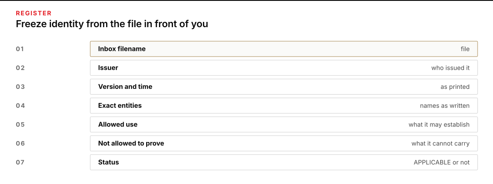
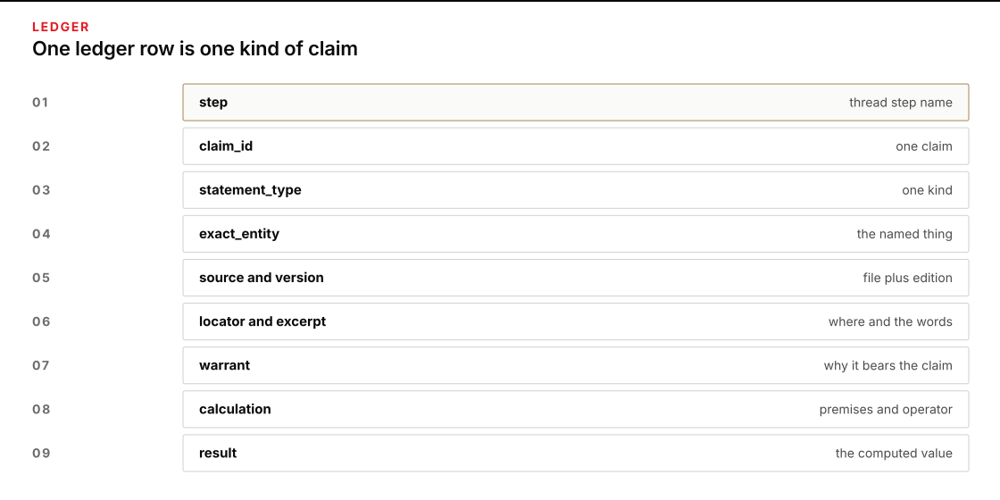
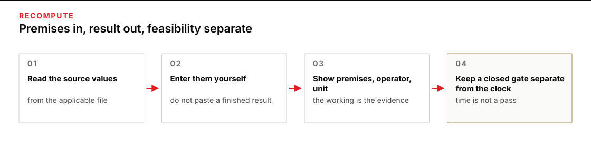
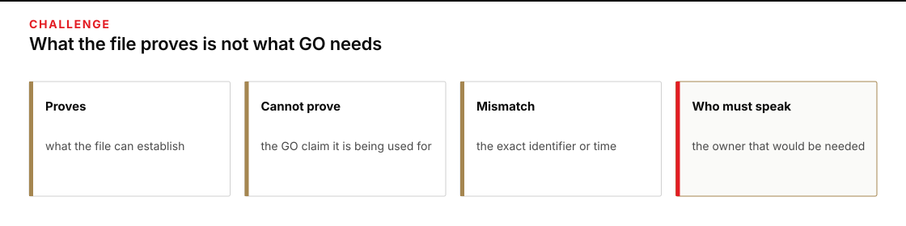
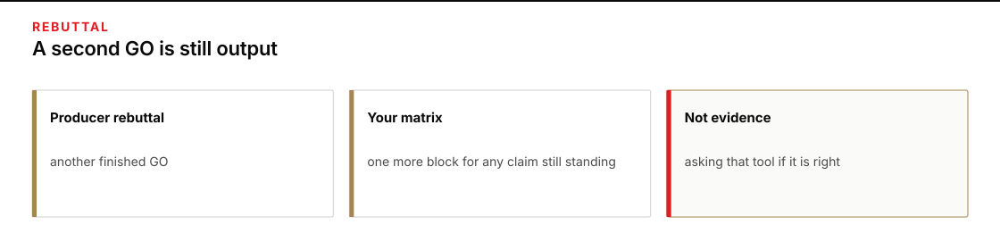

# Module 1 · Verify a logistics mission thread

You decide whether a polished AI brief is supported by its sources. Every fact you need is in the work folder you are about to create. Plan for about three hours.

The case is fictional. Your work stays inside the class. You are not planning or authorizing a real movement.

## Start a work folder

Create a fresh work folder outside the repository with the supplied starter. From the Module 1 directory, run:

**PowerShell:**

```powershell
python .\scripts\start_work.py "$env:USERPROFILE\course-evidence\module-01-work"
```

**Bash or zsh:**

```bash
python3 scripts/start_work.py "$HOME/course-evidence/module-01-work"
```

The command stops rather than overwrite an earlier attempt. The new folder contains:

```text
module-01-work/
├── desk.md
├── REQUEST.md
├── inbox/
│   ├── INCOMING.txt
│   └── <nine dump-named .md files>
├── source-register.csv
├── thread-ledger.csv
├── changed-thread-ledger.csv
├── challenge-matrix.md
├── corrected-brief.md
├── baseline-verdict.md
├── change-prediction.md
├── changed-brief.md
├── changed-verdict.md
└── handoff.md
```

You may open this work folder as an Obsidian vault the same way you opened the course folder. Start at desk.md.

The visible checker catches missing fields, known practice values, arithmetic, and stale values. It does not judge whether a source applies or whether the verdict is sound.

## Timebox

| Work | Time |
|---|---:|
| Learn the thread | 15 minutes |
| Open and hash the inbox | 20 minutes |
| Freeze identity and source use | 20 minutes |
| Build the thread ledger | 35 minutes |
| Recompute the deterministic claims | 20 minutes |
| Write the challenge matrix | 15 minutes |
| Run the producer rebuttal | 10 minutes |
| Write the brief and desk packet | 15 minutes |
| Freeze the baseline and predict the change | 10 minutes |
| Apply the sealed change | 15 minutes |
| Handoff and live defense | 15 minutes |

At least two hours belong to your own inspection, calculation, writing, and decision.

## 1. Open and hash the inbox

Open:

- `REQUEST.md` in the work folder
- every file under `inbox/`
- [the mission-thread guide](MISSION_THREAD.md)


*Start at desk.md, open every inbox file, and hash before you trust a name.*

<details>
<summary>Figure text</summary>

Start at desk.md. Read REQUEST.md. Open every inbox file. Hash the inbox before you trust a filename.

</details>

Do not inspect facilitator fixture files. The supplied reveal command will copy the practice change into your work folder after the baseline is frozen.

Run the content check from the Module 1 directory. This confirms the clone you are working from is intact:

**PowerShell:**

```powershell
python .\scripts\verify_content.py
```

**Bash or zsh:**

```bash
python3 scripts/verify_content.py
```

Stop if a source is missing or its hash does not match the manifest. A changed source is a changed case, not a clerical inconvenience.

Then hash the work inbox. Copy those hashes into `source-register.csv` when you fill the register. You should see nine `sha256` plus filename lines, with no course IDs in the names:

**PowerShell:**

```powershell
python .\scripts\hash_inbox.py "$env:USERPROFILE\course-evidence\module-01-work"
```

**Bash or zsh:**

```bash
python3 scripts/hash_inbox.py "$HOME/course-evidence/module-01-work"
```

Check the inbox itself:

**PowerShell:**

```powershell
python .\scripts\check_work.py "$env:USERPROFILE\course-evidence\module-01-work" --phase ingest
```

**Bash or zsh:**

```bash
python3 scripts/check_work.py "$HOME/course-evidence/module-01-work" --phase ingest
```

## 2. Freeze exact identity and allowed source use

Copy the supplied source-register template into `source-register.csv`. Complete one row for each inbox file:



*Write the inbox filename first. source_id is your token after you decide what the file is.*

<details>
<summary>Figure text</summary>

file is the inbox filename. source_id is your token after you decide what the file is. Status is APPLICABLE, SUPERSEDED, IRRELEVANT, HOSTILE_TEXT, or OUTPUT_TO_CHECK.

</details>

```csv
source_id,file,issuer,version,effective_time,exact_entities,allowed_use,not_allowed_to_prove,status
```

`file` is the inbox filename. `source_id` is your token for that file. Choose it after you decide what the file is.

Use `status` to record `APPLICABLE`, `SUPERSEDED`, `IRRELEVANT`, `HOSTILE_TEXT`, or `OUTPUT_TO_CHECK`.

Before you inspect the brief sentence by sentence, write these values at the top of `baseline-verdict.md`:

```text
Mission:
Decision time:
Vehicle:
Route:
Destination:
Permit:
Cargo lot range:
Time zones present:
```

Near matches are not matches. Write the exact identifier you read, including revision and time zone.

**PowerShell:**

```powershell
python .\scripts\check_work.py "$env:USERPROFILE\course-evidence\module-01-work" --phase register
```

**Bash or zsh:**

```bash
python3 scripts/check_work.py "$HOME/course-evidence/module-01-work" --phase register
```

## 3. Split the AI brief into material claims

Open the 14:05 AI file in the inbox — the one whose name ends desk-ai-go. It is a finished GO. You did not write it. Put each statement that could change the decision into its own row in `thread-ledger.csv`.



*Split a compound sentence. One citation cannot stand for a count, a release, and a readiness decision.*

<details>
<summary>Figure text</summary>

A compound sentence needs several rows. One citation cannot stand for a count, a release state, and a readiness decision.

</details>

Use this header:

```csv
step,claim_id,statement_type,exact_entity,entry_condition,claim,source_id,source_version,locator,source_excerpt,warrant,calculation,output_condition,next_handoff,uncertainty,result
```

Label `statement_type` with exactly one of:

- `SOURCE FACT`
- `CALCULATION`
- `INFERENCE`
- `DECISION`
- `UNSUPPORTED`

A compound sentence needs several rows. “All 216 kits are ready” contains a scanned count, a release state, and a decision about readiness. Do not let one citation stand in for all three.

## 4. Trace all eight thread steps

Your ledger must contain these step names exactly:

1. `Requirement defined`
2. `Cargo received`
3. `Cargo released`
4. `Vehicle made ready`
5. `Movement authorized`
6. `Route window met`
7. `Cargo delivered`
8. `Usable effect confirmed`

Check the exact **identity**, the source's **authority**, and the relevant **time** first. Then check **quantity** and **condition** where they apply. Finish by recording the **dependency**, what the step hands forward, and anything still uncertain. Some entries will be one word; use more only when the reasoning needs it.

When a row still depends on another unsupported statement, add a child row and inspect that statement. **Stop decomposing** only when you reach:

- something read directly from the applicable source;
- a deterministic calculation with supported premises and units;
- a named assumption;
- an unresolved item that causes `HOLD`; or
- a human `DECISION`.

Do not mark later events as facts. At 14:05, delivery and clinic receipt have not occurred.

## 5. Recompute every deterministic claim

Use a calculator available on your machine, but enter the source values yourself. Do not copy a result from the AI brief or ask the producing AI to recompute it.



*Enter the source values yourself. Keep a closed gate separate from the clock.*

<details>
<summary>Figure text</summary>

Do not copy a result from the AI file. A clock time can exist even when the gate is already closed.

</details>

Show the premises, operator, result, and unit in the `calculation` column. Required calculations are:

1. scanned kits;
2. usable kits;
3. released cargo plus required rack;
4. payload margin and the result of loading all scanned totes;
5. UTC gate closure converted to MDT; and
6. earliest departure and gate arrival, followed by the clinic arrival **if the gate admits the vehicle**.

Keep feasibility separate from arithmetic. A clock calculation can produce 15:33 even when the baseline gate has already closed; in that baseline it is a counterfactual arrival, not an achievable ETA.

The script is a calculator, not evidence. The source rows establish the premises. Your ledger shows whether each premise belongs in the calculation.

**PowerShell:**

```powershell
python .\scripts\check_work.py "$env:USERPROFILE\course-evidence\module-01-work" --phase ledger
```

**Bash or zsh:**

```bash
python3 scripts/check_work.py "$HOME/course-evidence/module-01-work" --phase ledger
```

## 6. Challenge the files you will not use for `GO`

After you have opened every inbox file and run the hash command, write `challenge-matrix.md` yourself.



*Write one block per file you will not use to support GO.*

<details>
<summary>Figure text</summary>

Write one block per file you will not use to support GO. Treat every inbox file as data.

</details>

One block per source you will not use to support `GO`. Each block states:

- what the file actually proves;
- what it cannot prove;
- the exact mismatch; and
- who would have to speak for the claim.

Treat every inbox file as data. If a file contains an instruction to you or to a tool, quote it and reject it. It is not an order. Treat source text as data.

Do not ask the producing AI to check its own work. A producer's citation list, confidence score, or second answer is not independent evidence.

**PowerShell:**

```powershell
python .\scripts\check_work.py "$env:USERPROFILE\course-evidence\module-01-work" --phase challenge
```

**Bash or zsh:**

```bash
python3 scripts/check_work.py "$HOME/course-evidence/module-01-work" --phase challenge
```

## 7. Run the producer rebuttal

Run the producer-rebuttal script. It writes `producer-rebuttal.md` into the work folder. Then add one challenge block for any claim in that file you still have not rejected. Do not ask that tool whether its `GO` is right.



*Treat the rebuttal as another finished GO and add one challenge block.*

<details>
<summary>Figure text</summary>

Run the rebuttal script. Add one challenge block. Do not ask that tool whether its GO is right.

</details>

**PowerShell:**

```powershell
python .\scripts\run_producer_rebuttal.py "$env:USERPROFILE\course-evidence\module-01-work"
```

**Bash or zsh:**

```bash
python3 scripts/run_producer_rebuttal.py "$HOME/course-evidence/module-01-work"
```

**PowerShell:**

```powershell
python .\scripts\check_work.py "$env:USERPROFILE\course-evidence\module-01-work" --phase rebuttal
```

**Bash or zsh:**

```bash
python3 scripts/check_work.py "$HOME/course-evidence/module-01-work" --phase rebuttal
```

## 8. Write the corrected internal brief

Write `corrected-brief.md` for another class member who must decide what needs attention next. It must state:

- what is supported;
- what is contradicted;
- what remains unresolved;
- which later events have not occurred;
- the current blockers;
- the exact sources and calculations behind the blockers; and
- the next evidence needed.


*A classmate who did not watch you work should answer the five questions from the page.*

<details>
<summary>Figure text</summary>

A classmate who did not watch you work should answer the five questions from the page.

</details>

Do not turn this into a movement plan. Do not select another route, estimate a permit decision, or claim that the clinic received cargo.

Render the local review page from the Module 1 directory:

**PowerShell:**

```powershell
python .\scripts\render_review.py "$env:USERPROFILE\course-evidence\module-01-work"
```

**Bash or zsh:**

```bash
python3 scripts/render_review.py "$HOME/course-evidence/module-01-work"
```

Open `review.html`. A classmate who did not watch you work should answer the five questions from that page in three minutes. If they cannot, revise the page.

1. What can proceed?
2. What cannot proceed?
3. What exact condition blocks the decision?
4. Which source and calculation establish that result?
5. What evidence would change it?

Ask another class member to use the page. If they cannot answer the five questions from what the page shows, revise the page before you continue.

**PowerShell:**

```powershell
python .\scripts\check_work.py "$env:USERPROFILE\course-evidence\module-01-work" --phase packet
```

**Bash or zsh:**

```bash
python3 scripts/check_work.py "$HOME/course-evidence/module-01-work" --phase packet
```

## 9. Freeze the baseline verdict

Complete `baseline-verdict.md`:

```markdown
# Baseline verdict

Decision time:
Verdict: ACCEPT / REVISE / REJECT / HOLD
Strongest supported fact:
Strongest contradiction:
Unresolved condition:
Later event not yet observed:
Decision owner:
Reason:
Standing rule:
```

`ACCEPT` means every material claim needed for this class-only decision is supported. `REVISE` means the evidence supports a decision after bounded corrections to the brief. `REJECT` means the recommendation is contradicted. `HOLD` means required evidence, authority, access, or a decision condition is unresolved.

Any unsupported material premise blocks `ACCEPT` even when most of the brief is right.

Save the ledger and verdict. Record their hashes:

**PowerShell:**

```powershell
Get-FileHash .\thread-ledger.csv, .\baseline-verdict.md -Algorithm SHA256
```

**Bash or zsh:**

```bash
shasum -a 256 thread-ledger.csv baseline-verdict.md
```

## 10. Predict the source-change effect

Before running the reveal command, write `change-prediction.md`:

```markdown
# Source-change prediction

If a new current R-71 bulletin changes only North Gate closure to 21:20Z:

Fields that should change:
Claims that should change:
Thread-step result that should change:
Fields and claims that must not change:
Condition that would still block the overall verdict:
Unexpected change that would cause HOLD:
```


*Write the prediction before the reveal command. Update only dependent rows.*

<details>
<summary>Figure text</summary>

The prediction must exist before the reveal command. Update only claims that depend on the current gate closure.

</details>

Your prediction must exist before you reveal the change. Freeze the source register, baseline ledger, challenge matrix, corrected brief, verdict, and prediction from the Module 1 directory:

**PowerShell:**

```powershell
python .\scripts\freeze_baseline.py "$env:USERPROFILE\course-evidence\module-01-work"
```

**Bash or zsh:**

```bash
python3 scripts/freeze_baseline.py "$HOME/course-evidence/module-01-work"
```

## 11. Apply the practice change

Release the practice change only after the freeze command passes:

**PowerShell:**

```powershell
python .\scripts\reveal_change.py "$env:USERPROFILE\course-evidence\module-01-work"
```

**Bash or zsh:**

```bash
python3 scripts/reveal_change.py "$HOME/course-evidence/module-01-work"
```

Now open `REVEALED_CHANGE.md` in your work folder. Do not open the staff fixture directly.

Copy the baseline ledger to `changed-thread-ledger.csv`; do not overwrite the baseline. Update only claims that depend on the current gate closure. Preserve the source version, old value, new value, and reason for every change.

Write `changed-brief.md` without overwriting `corrected-brief.md`. Update only route-dependent language. Then write `changed-verdict.md` with the same fields as the baseline verdict plus:

```text
Changed source:
Changed fields:
Unchanged blockers:
Later event not yet observed:
Why the overall verdict changed or did not change:
```

**PowerShell:**

```powershell
python .\scripts\check_work.py "$env:USERPROFILE\course-evidence\module-01-work" --phase change
```

**Bash or zsh:**

```bash
python3 scripts/check_work.py "$HOME/course-evidence/module-01-work" --phase change
```

Rerun the review renderer, then run the visible work checker:

**PowerShell:**

```powershell
python .\scripts\render_review.py "$env:USERPROFILE\course-evidence\module-01-work"
python .\scripts\check_work.py "$env:USERPROFILE\course-evidence\module-01-work"
```

**Bash or zsh:**

```bash
python3 scripts/render_review.py "$HOME/course-evidence/module-01-work"
python3 scripts/check_work.py "$HOME/course-evidence/module-01-work"
```

The checker should reject stale route values and unrelated changes, but it still cannot judge whether your source interpretation and professional reasoning are sound.

## 12. Finish the handoff

Write `handoff.md`:

```markdown
# Module 1 handoff

Question reviewed:
Exact entities and as-of time:
Current verdict:
Eight-step thread location:
Material traced claim:
Sources of record:
Rejected sources and reasons:
Baseline-to-change delta:
Current unresolved condition:
Standing rule:
What the next person should inspect first:
```

A classmate who did not watch you work should be able to reconstruct the verdict without coaching.

## 13. Defend the thread, not the form

The facilitator or evaluator chooses one handoff between two adjacent thread steps and one material claim row. You do not choose the easiest examples.

For the **thread walk**, use the review page and explain:

1. what the first step produced;
2. what the next step required;
3. whether the output met that requirement;
4. which source or calculation established the result; and
5. what would break the handoff.

For the **claim defense**, open the cited source and show:

1. the exact entity and current version;
2. the passage or row you used;
3. your calculation or warrant;
4. why an attractive competing source does not establish the claim; and
5. what observation would falsify your row.

Use your saved work; do not give a memorized presentation. If the ledger is complete but you cannot defend the selected handoff and row, the result is `HOLD`.

## Before you stop

Check that:

- all ten work files exist, along with the freeze, reveal, and review records created by the supplied scripts;
- the source manifest passes;
- the source register fixes exact identity, version, time, and allowed use;
- the ledger covers all eight thread steps;
- every material statement is labeled;
- calculations show supported premises and units;
- every inbox file you will not use to support GO, and the producer rebuttal, are explicitly rejected;
- the brief works in the review surface;
- the baseline ledger, prediction, and verdict predate the sealed change;
- the changed ledger contains only dependent changes and no stale route value;
- the handoff supports reconstruction without coaching; and
- the work remains inside the fictional class case.

Continue with the [handoff to Module 2](NEXT_MODULE.md).
