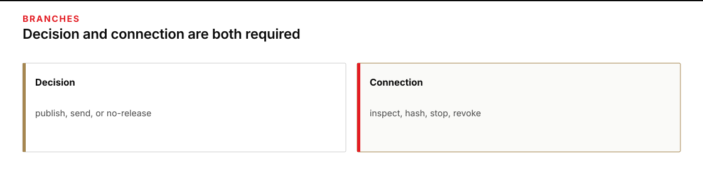

# Module 3 · Decide responsible release and operate bounded tools

Plan for one three-hour session. You will decide whether the supplied packet may leave the class, then hash one designated file from it with a tool that can read one file under the case root and write nothing.

The packet is NB-NOTE-17: forty files describing burn-dressing cases from Mill Depot to Clinic B-2 on vehicle MH-6. The files are for named class participants. The packet is not a public movement order.

## Start here

1. Open [the Module 3 lab](shared/MODULE_03_LAB.md).
2. Read the [public scoring rubric](assessment/PUBLIC_RUBRIC.md) before you record a position.
3. If you use assistive technology or need another way to inspect the packet, read [Accessibility and equivalent inspection](shared/ACCESSIBILITY.md).

## Two branches

The **decision** branch asks whether the packet may be published, sent to a real operations list, or used as a real dispatch. Record a position supported by citations under the six concerns. Establish from the packet who, if anyone, could authorize sharing beyond the class; do not assume that a true operational fact grants that authority.

*Record the release decision and complete the tool branch.*

Figure text

The decision branch records whether the packet may be published or dispatched. The connection branch inspects, runs, and revokes the hash tool. Both branches are required.

The **connection** branch asks you to inspect the hash tool, run it on the designated file, combine the untrusted override prompt with that tool, then disconnect and revoke the script.

A careful decision does not replace the tool work.

## Class-only boundary

All names, movements, and addresses are fictional course fixtures. Do not use this packet to plan, authorize, dispatch, or describe a real movement. A module result permits only class review.
